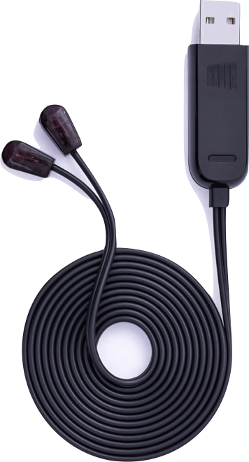
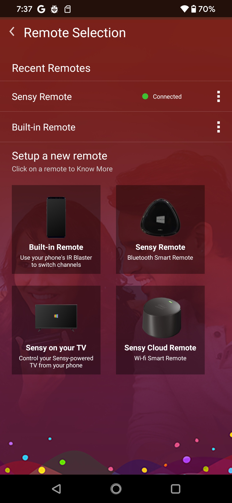
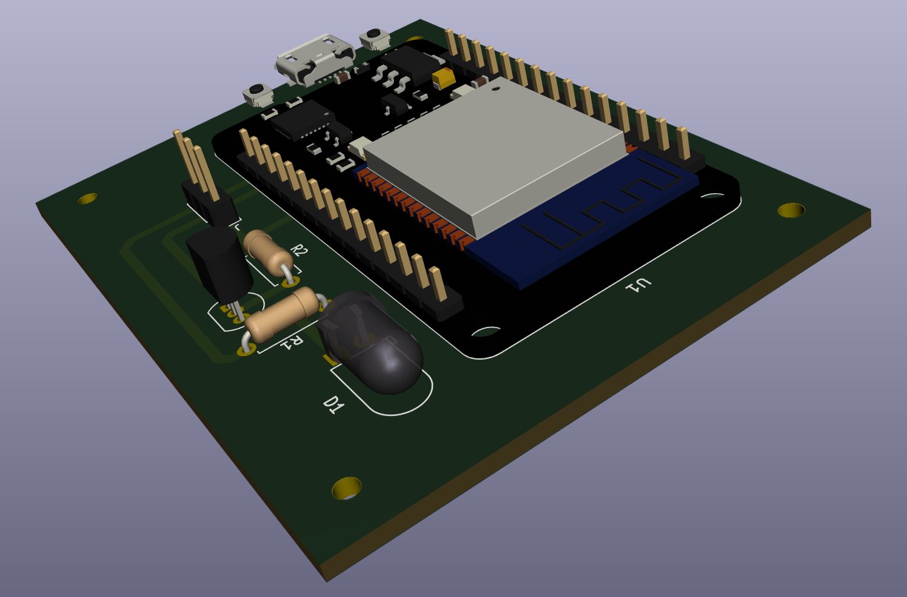
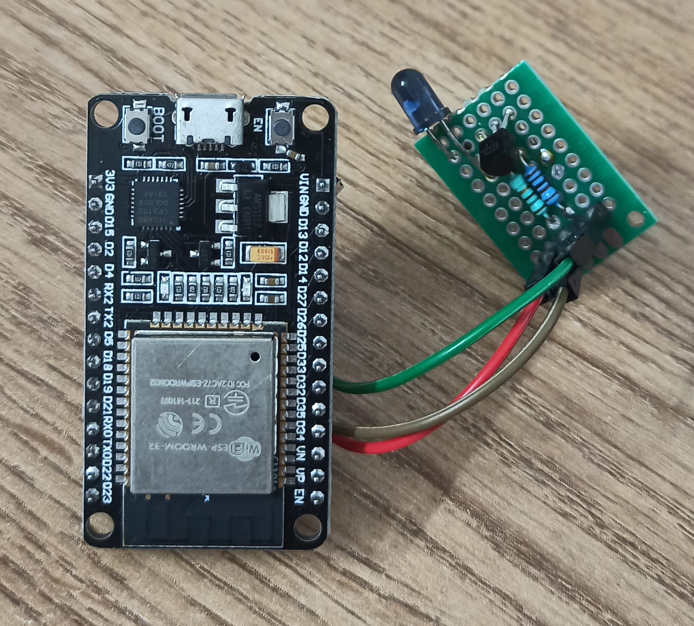

### PySensy

Python "library" for controlling `Sensy IR Cable` + `Mi IR Cable`. This IR
Cable is essentially a USB enabled `IR Universal Remote`.

While we have the IR cable hardware we didn't have the software to use it as
a IR remote control...until now.

ATTENTION: This educational reverse engineering work was carried for enabling
'software interoperability' of Sensy Hardware with Linux (+ other free
systems). Any commercial/pecuniary usage is STRICTLY FORBIDDEN and is at your
own risk!

<br>




### Device Discovery

```
$ dmesg
[14520.215997] usb 1-2: new full-speed USB device number 8 using xhci_hcd
[14520.344268] usb 1-2: New USB device found, idVendor=2717, idProduct=003d, bcdDevice= 1.00
[14520.344276] usb 1-2: New USB device strings: Mfr=1, Product=2, SerialNumber=0
[14520.344281] usb 1-2: Product: Sensy USB Consumer IR Dongle
[14520.344285] usb 1-2: Manufacturer: Sensara Technologies
```

```
$ lsusb
Bus 001 Device 008: ID 2717:003d Xiaomi Inc. Sensy USB Consumer IR Dongle
```

Here are the USB interface descriptors present on this device.

```
$ lsusb -vvv
DEVICE ID 2717:003d on Bus 001 Address 009 =================
 bLength                :   0x12 (18 bytes)
 bDescriptorType        :    0x1 Device
 bcdUSB                 :  0x200 USB 2.0
 bDeviceClass           :    0x0 Specified at interface
 bDeviceSubClass        :    0x0
 bDeviceProtocol        :    0x0
 bMaxPacketSize0        :   0x40 (64 bytes)
 idVendor               : 0x2717
 idProduct              : 0x003d
 bcdDevice              :  0x100 Device 1.0
 iManufacturer          :    0x1 Sensara Technologies
 iProduct               :    0x2 Sensy USB Consumer IR Dongle
 iSerialNumber          :    0x0
 bNumConfigurations     :    0x1
  CONFIGURATION 1: 500 mA ==================================
   bLength              :    0x9 (9 bytes)
   bDescriptorType      :    0x2 Configuration
   wTotalLength         :   0x2e (46 bytes)
   bNumInterfaces       :    0x1
   bConfigurationValue  :    0x1
   iConfiguration       :    0x0
   bmAttributes         :   0x80 Bus Powered
   bMaxPower            :   0xfa (500 mA)
    INTERFACE 0: Vendor Specific ===========================
     bLength            :    0x9 (9 bytes)
     bDescriptorType    :    0x4 Interface
     bInterfaceNumber   :    0x0
     bAlternateSetting  :    0x0
     bNumEndpoints      :    0x4
     bInterfaceClass    :   0xff Vendor Specific
     bInterfaceSubClass :   0xff
     bInterfaceProtocol :   0xff
     iInterface         :    0x0
      ENDPOINT 0x81: Interrupt IN ==========================
       bLength          :    0x7 (7 bytes)
       bDescriptorType  :    0x5 Endpoint
       bEndpointAddress :   0x81 IN
       bmAttributes     :    0x3 Interrupt
       wMaxPacketSize   :   0x40 (64 bytes)
       bInterval        :    0x1
      ENDPOINT 0x2: Interrupt OUT ==========================
       bLength          :    0x7 (7 bytes)
       bDescriptorType  :    0x5 Endpoint
       bEndpointAddress :    0x2 OUT
       bmAttributes     :    0x3 Interrupt
       wMaxPacketSize   :   0x40 (64 bytes)
       bInterval        :    0x1
      ENDPOINT 0x83: Bulk IN ===============================
       bLength          :    0x7 (7 bytes)
       bDescriptorType  :    0x5 Endpoint
       bEndpointAddress :   0x83 IN
       bmAttributes     :    0x2 Bulk
       wMaxPacketSize   :   0x40 (64 bytes)
       bInterval        :    0x0
      ENDPOINT 0x4: Bulk OUT ===============================
       bLength          :    0x7 (7 bytes)
       bDescriptorType  :    0x5 Endpoint
       bEndpointAddress :    0x4 OUT
       bmAttributes     :    0x2 Bulk
       wMaxPacketSize   :   0x40 (64 bytes)
       bInterval        :    0x0
```

The devices accepts various command opcodes on its `command_endpoint`. These
opcodes were determined by reversing the `Sensy Remote` Android app.


### Setup

```
pip3 install -r requirements.txt
```


### Work Notes

https://github.com/skylot/jadx was used to reverse engineer the "Sensy Remote"
APK file.

Dynamic tracing notes:

```
$ frida-trace -U -n co.sensara.appsense -j '*!*PulseSequence*/isu'
Started tracing 14 functions. Press Ctrl+C to stop.
           /* TID 0x4c61 */
 71156 ms  PulseSequence.space(3800)
 71160 ms  <= "<instance: co.sensara.sensy.infrared.PulseSequence>"
 71163 ms  PulseSequence.$init()
 71164 ms  PulseSequence.space(9158)
 71166 ms  <= "<instance: co.sensara.sensy.infrared.PulseSequence>"
 71168 ms  PulseSequence.space(12958)
 71170 ms  <= "<instance: co.sensara.sensy.infrared.PulseSequence>"
           /* TID 0x4cc8 */
 71172 ms  Code.getPulseSequence()
 71173 ms  <= "<instance: co.sensara.sensy.infrared.PulseSequence>"
 71178 ms  PulseSequence.flatten("<instance: java.util.List, $className: java.util.ArrayList>")
 71180 ms     | PulseSequence.$init("<instance: co.sensara.sensy.infrared.PulseSequence>")
 71184 ms  <= "<instance: co.sensara.sensy.infrared.PulseSequence>"
```

```
http://irdb.tk/find/ <- Lovely!

For "Samsung TV Menu" keypress (E0E058A7). This TV uses "Protocol NECx2".

Menu -> 00 00 25 00 D0 04 08 D0 08 D0 01 1A 03 4E 01 1A 01 1A 01 1A 5A DE A2 01 11 22 22 21 11 22 22 22 12 11 22 21 21 22 11 13
```

```
$ frida-trace -U -n co.sensara.appsense -j '*!*extract*/isu'
Started tracing 5 functions. Press Ctrl+C to stop.
           /* TID 0x4cc8 */
  5498 ms  PulseSequence.extract()
  5500 ms  <= [171,171,21,60,21,60,21,60,21,21,21,21,21,21,21,21,21,21,21,60,21,60,21,60,21,21,21,21,21,21,21,21,21,21,21,21,21,60,21,21,21,60,21,60,21,21,21,21,21,21,21,60,21,21,21,60,21,21,21,21,21,60,21,60,21,60,21]
C9480000
```

```
$ frida-trace -U -n co.sensara.appsense -j '*!*infrare*/isu'

Started tracing 169 functions. Press Ctrl+C to stop.
           /* TID 0x4c61 */
  4070 ms  IRManager.getInstance()
  4074 ms  <= "<instance: co.sensara.sensy.infrared.IRManager>"
  4076 ms  IRManager.getSelectedOutputDevice()
  4079 ms  <= "<instance: co.sensara.sensy.infrared.ConsumerIRManager, $className: co.sensara.sensy.infrared.IMUStabilizedRemote>"
  4079 ms  IRManager.getInstance()
  4080 ms  <= "<instance: co.sensara.sensy.infrared.IRManager>"
  4106 ms  IRManager.getInstance()
  4106 ms  <= "<instance: co.sensara.sensy.infrared.IRManager>"
  4107 ms  IRManager.getSelectedOutputDevice()
  4107 ms  <= "<instance: co.sensara.sensy.infrared.ConsumerIRManager, $className: co.sensara.sensy.infrared.IMUStabilizedRemote>"
  4109 ms  BurstSequence.add("<instance: co.sensara.sensy.infrared.BurstSequence>") <-- who calls this and with what data?
  4110 ms  PulseSequence.space(3800)
  4114 ms  <= "<instance: co.sensara.sensy.infrared.PulseSequence>"
  4115 ms  IRManager.send(38000, "<instance: co.sensara.sensy.infrared.BurstSequence>", true, 241)
  4115 ms     | PulseSequence.$init()
  4116 ms     | PulseSequence.space(9158)
  4117 ms     | <= "<instance: co.sensara.sensy.infrared.PulseSequence>"
  4119 ms     | BurstSequence.add("<instance: co.sensara.sensy.infrared.IBurst, $className: co.sensara.sensy.infrared.Gap>")
  4120 ms     | BurstSequence.optimize()
  4121 ms     |    | PulseSequence.space(12958)
  4122 ms     |    | <= "<instance: co.sensara.sensy.infrared.PulseSequence>"
  4123 ms     | <= "<instance: co.sensara.sensy.infrared.BurstSequence>"
  4123 ms     | IMUStabilizedRemote.transmit("<instance: co.sensara.sensy.infrared.BurstSequence>")
           /* TID 0x4cc8 */
```


```
$ frida-trace -U -n co.sensara.appsense -j '*!*transmit*/isu'
Started tracing 7 functions. Press Ctrl+C to stop.
           /* TID 0x4c61 */
  9447 ms  IMUStabilizedRemote.transmit("<instance: co.sensara.sensy.infrared.BurstSequence>")
           /* TID 0x4cc8 */
  9455 ms  ConsumerIRManager$AndroidIRManager.transmit(38000, [171,171,21,60,21,60,21,60,21,21,21,21,21,21,21,21,21,21,21,60,21,60,21,60,21,21,21,21,21,21,21,21,21,21,21,21,21,60,21,21,21,60,21,60,21,21,21,21,21,21,21,60,21,21,21,60,21,21,21,21,21,60,21,60,21,60,21])
```

```
$ frida-trace -U -n co.sensara.appsense -j '*NEC*!*encode*/su'  # now reload "SAMSUNG" menu option.
Started tracing 2 functions. Press Ctrl+C to stop.
           /* TID 0x63b6 */
  4827 ms  NEC_SHORT.encode("3772810873", 32)
  4830 ms  <= "<instance: co.sensara.sensy.infrared.PulseSequence>"
  4831 ms  NEC_SHORT.encode("3772803223", 32)
  4832 ms  <= "<instance: co.sensara.sensy.infrared.PulseSequence>"
  4833 ms  NEC_SHORT.encode("3772839943", 32)
  4833 ms  <= "<instance: co.sensara.sensy.infrared.PulseSequence>"
  4834 ms  NEC_SHORT.encode("3772833823", 32)
  4834 ms  <= "<instance: co.sensara.sensy.infrared.PulseSequence>"
  4835 ms  NEC_SHORT.encode("3772794553", 32)
  4835 ms  <= "<instance: co.sensara.sensy.infrared.PulseSequence>"
  4836 ms  NEC_SHORT.encode("3772778233", 32)
  4836 ms  <= "<instance: co.sensara.sensy.infrared.PulseSequence>"
  4837 ms  NEC_SHORT.encode("3772782313", 32)
  4837 ms  <= "<instance: co.sensara.sensy.infrared.PulseSequence>"
  4837 ms  NEC_SHORT.encode("3772819033", 32)
  4837 ms  <= "<instance: co.sensara.sensy.infrared.PulseSequence>"
  4838 ms  NEC_SHORT.encode("3772789198", 32)
  4838 ms  <= "<instance: co.sensara.sensy.infrared.PulseSequence>"
  4838 ms  NEC_SHORT.encode("3772795063", 32)
  4839 ms  <= "<instance: co.sensara.sensy.infrared.PulseSequence>"
  4839 ms  NEC_SHORT.encode("3772793023", 32)
  4839 ms  <= "<instance: co.sensara.sensy.infrared.PulseSequence>"
  4840 ms  NEC_SHORT.encode("3772829743", 32)
  4840 ms  <= "<instance: co.sensara.sensy.infrared.PulseSequence>"
  4840 ms  NEC_SHORT.encode("3772786903", 32)
  4841 ms  <= "<instance: co.sensara.sensy.infrared.PulseSequence>"
  4841 ms  NEC_SHORT.encode("3772837903", 32)
  4841 ms  <= "<instance: co.sensara.sensy.infrared.PulseSequence>"
  4841 ms  NEC_SHORT.encode("3772782313", 32)
  4842 ms  <= "<instance: co.sensara.sensy.infrared.PulseSequence>"
  4842 ms  NEC_SHORT.encode("3772811383", 32)
  4842 ms  <= "<instance: co.sensara.sensy.infrared.PulseSequence>"
  4843 ms  NEC_SHORT.encode("3772790473", 32)
  4843 ms  <= "<instance: co.sensara.sensy.infrared.PulseSequence>"
  4843 ms  NEC_SHORT.encode("3772784863", 32)
  4844 ms  <= "<instance: co.sensara.sensy.infrared.PulseSequence>"
  4844 ms  NEC_SHORT.encode("3772817503", 32)
  4844 ms  <= "<instance: co.sensara.sensy.infrared.PulseSequence>"
  4845 ms  NEC_SHORT.encode("3772801183", 32)
  4845 ms  <= "<instance: co.sensara.sensy.infrared.PulseSequence>"
  4845 ms  NEC_SHORT.encode("3772780783", 32)
  4845 ms  <= "<instance: co.sensara.sensy.infrared.PulseSequence>"
  4846 ms  NEC_SHORT.encode("3772813423", 32)
  4846 ms  <= "<instance: co.sensara.sensy.infrared.PulseSequence>"
  4846 ms  NEC_SHORT.encode("3772797103", 32)
  4847 ms  <= "<instance: co.sensara.sensy.infrared.PulseSequence>"
  4847 ms  NEC_SHORT.encode("3772788943", 32)
  4847 ms  <= "<instance: co.sensara.sensy.infrared.PulseSequence>"
  4847 ms  NEC_SHORT.encode("3772809343", 32)
  4848 ms  <= "<instance: co.sensara.sensy.infrared.PulseSequence>"
  4848 ms  NEC_SHORT.encode("3772821583", 32)
  4848 ms  <= "<instance: co.sensara.sensy.infrared.PulseSequence>"
  4849 ms  NEC_SHORT.encode("3772805263", 32)
  4849 ms  <= "<instance: co.sensara.sensy.infrared.PulseSequence>"
  4849 ms  NEC_SHORT.encode("3772783333", 32)
  4849 ms  <= "<instance: co.sensara.sensy.infrared.PulseSequence>"
  4850 ms  NEC_SHORT.encode("3772799143", 32) <<< Our "Menu" button
  4850 ms  <= "<instance: co.sensara.sensy.infrared.PulseSequence>"
  4850 ms  NEC_SHORT.encode("3772819543", 32)
  4851 ms  <= "<instance: co.sensara.sensy.infrared.PulseSequence>"
  4851 ms  NEC_SHORT.encode("3772778743", 32)
  4851 ms  <= "<instance: co.sensara.sensy.infrared.PulseSequence>"
```


### Demo


Let's emulate this common remote using `Sensy IR Cable`!


```
$ python3 example.py
[!] Device has been reset
[+] Device version is 1
[+] State: Idle
[+] State: Idle
[+] Device configured OK
[+] Started buffering OK
[+] State: Buffering
[+] Ended buffering OK
[+] State: Emitting
[+] State: Idle
```

This program will emulate the `0` key press of this `Car MP3 Remote`.

Note: The firmware seems to have a bug related to sending 24-bit NEC IR codes.
Instead of sending "AABBCC", the firmware emits "AABBCC00" (added trailing `0`
byte). Or maybe our userspace driver is buggy ;)


### References

- [The evolution of Sensy Infrared Blasters](https://www.linkedin.com/pulse/evolution-sensy-infrared-blasters-bharath-kumar-mohan/)

- http://www.sensyremote.com/


### Next exercise

So far, we have built software for the hardware (i.e. Sensy IR Cable) we had. As
a bonus exercise, we also built the hardware for the software (`Sensy Remote`
APK) we have ;)


The Sensy Home device lets you use your smartphone as a remote if it doesn't
have an IR Blaster. Thanks to four IR Blasters, it provides 360-degree
coverage. The Sensy Home is powered by a pair of AA batteries (included in the
package), which can last a year according to the brand. If your smartphone
already has an IR Blaster, you can download the free Sensy app and begin using
it as a remote right away (this text is borrowed from the internet).

Our alt-hardware mimics the `Sensy BLE Remote` using a ESP32 Dev Module.




The official `Sensy Android App` detects our `Clone BLE IR Blaster HW` just fine ;)






### References

- https://github.com/kholia/Easy-IR-System

- https://en.wikipedia.org/wiki/Digital_Millennium_Copyright_Act (`2015 rulemaking`)
